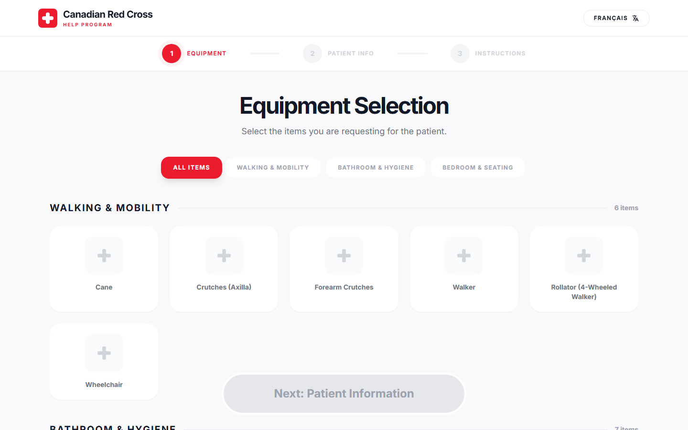

<div align="center">

# HELP Equipment Guidance Portal

A bilingual equipment-selection prototype inspired by the Canadian Red Cross Health Equipment Loan Program (HELP).

[](https://react.dev/)
[](https://www.typescriptlang.org/)
[](https://vite.dev/)
[](https://help-equipment-loan-program-canadia.vercel.app/)

[Live demo](https://help-equipment-loan-program-canadia.vercel.app/) · [Features](#features) · [Run locally](#run-locally) · [Project structure](#project-structure)

</div>



## Overview

This project explores a simpler digital workflow for choosing loaned health equipment and finding the right setup guidance. A user selects one or more items, enters the patient's height and weight, and receives a guidance pack with basic sizing suggestions, weight-capacity checks, and downloadable instructions.

The interface supports English and French, metric and imperial measurements, and 18 equipment types across mobility, bathroom, and bedroom categories.

## How it works

1. **Choose equipment** from the complete catalogue or filter by category.
2. **Enter patient measurements** in feet/pounds or centimetres/kilograms.
3. **Review guidance** for each selected item, including weight-capacity status, basic sizing information, and a downloadable PDF.

The entire flow runs in the browser. No account, backend, database, or API key is required.

## Features

- English and French interface toggle
- Responsive three-step request flow
- Multi-select equipment catalogue with category filters
- Imperial and metric measurement conversion
- Per-item maximum-weight comparison
- Basic height-derived sizing suggestions for supported equipment
- 18 bundled equipment instruction PDFs
- Keyboard-friendly selection controls and accessible state labels
- Static deployment suitable for Vercel, Netlify, or GitHub Pages

## Equipment catalogue

| Category | Included equipment |
| --- | --- |
| Walking and mobility | Cane, axilla crutches, forearm crutches, walker, rollator, wheelchair |
| Bathroom and hygiene | Bath board, transfer bench, shower chair, tub grab bar, raised toilet seat, toilet safety frame, toilet seat elevator |
| Bedroom and seating | Bed-assist handle, bed cradle, commode, IV pole, wheelchair cushion |

Catalogue data lives in [`constants.tsx`](./constants.tsx). Each item defines its localized name and description, category, image URL, instruction PDF, maximum supported weight, and sizing note.

## Built with

| Layer | Technology |
| --- | --- |
| Interface | React 19 + TypeScript |
| Build tooling | Vite 6 |
| Styling | Tailwind CSS via CDN |
| Typography | Inter via Google Fonts |
| Deployment | Static Vite build hosted on Vercel |

## Run locally

### Prerequisites

- [Node.js](https://nodejs.org/) 18 or newer
- npm, included with Node.js

### Setup

```bash
git clone https://github.com/7kzaincode/-HELP-EQUIPMENT-LOAN-PROGRAM---Canadian-Red-Cross.git
cd -- -HELP-EQUIPMENT-LOAN-PROGRAM---Canadian-Red-Cross
npm install
npm run dev
```

Vite serves the app at [http://localhost:3000](http://localhost:3000).

No `.env` file or API credentials are needed.

### Production build

```bash
npm run build
npm run preview
```

The build command creates deployable static files in `dist/`. The preview command serves that production build locally.

## Project structure

```text
.
├── App.tsx                    # Three-step flow and application state
├── components/
│   ├── InfoStep.tsx           # Patient measurements and unit conversion
│   ├── Layout.tsx             # Header, language control, and footer
│   ├── ResultStep.tsx         # Capacity checks, sizing, and PDF links
│   └── SelectionStep.tsx      # Equipment catalogue and filters
├── public/assets/pdfs/        # Equipment instruction documents
├── docs/app-preview.png       # Repository preview image
├── constants.tsx              # Translations and equipment catalogue
├── types.ts                   # Shared domain types
├── index.tsx                  # React entry point
└── vite.config.ts             # Development server and build settings
```

## Customize the catalogue

Add or edit equipment in `EQUIPMENT_DATA` inside [`constants.tsx`](./constants.tsx):

```tsx
{
  id: 'walker',
  category: 'mobility',
  name: { en: 'Walker', fr: 'Déambulateur' },
  description: {
    en: 'Standard folding walker for maximum stability.',
    fr: 'Cadre de marche pliant standard.'
  },
  imageUrl: 'https://example.com/walker.jpg',
  pdfUrl: '/assets/pdfs/walker.pdf',
  maxWeightLbs: 300,
  sizingGuide: {
    en: 'Hand grips should be level with the wrists.',
    fr: 'Poignées au niveau des poignets.'
  }
}
```

Place local instruction files in `public/assets/pdfs/`, then reference them from the catalogue with an absolute public path such as `/assets/pdfs/walker.pdf`.

Interface copy is stored in the `TRANSLATIONS` object in the same file. Every translation key must provide both `en` and `fr` values.

## Current limitations

- Product images come from Picsum placeholders rather than verified equipment photography.
- Sizing calculations are deliberately basic and only cover a subset of equipment.
- Weight limits are sample catalogue data and may not match a specific device model.
- The **Share Results** control is visual only and has no sharing behavior yet.
- Data is held in browser memory and resets when the page reloads.
- Tailwind is loaded from its CDN development script rather than compiled into the production bundle.

These are especially important constraints for a health-related interface. Treat the current application as a UX and engineering prototype, not a deployable clinical system.

## Scripts

| Command | Purpose |
| --- | --- |
| `npm run dev` | Start the Vite development server on port 3000 |
| `npm run build` | Create the optimized production build |
| `npm run preview` | Serve the production build locally |

## Acknowledgements

The concept is inspired by the [Canadian Red Cross Health Equipment Loan Program](https://www.redcross.ca/how-we-help/community-health-services-in-canada/health-equipment-loan-program), which provides short-term loans of health equipment in participating communities. Canadian Red Cross names, marks, and program materials belong to their respective owners. Made for use by Canadian Red Cross Health Organization
